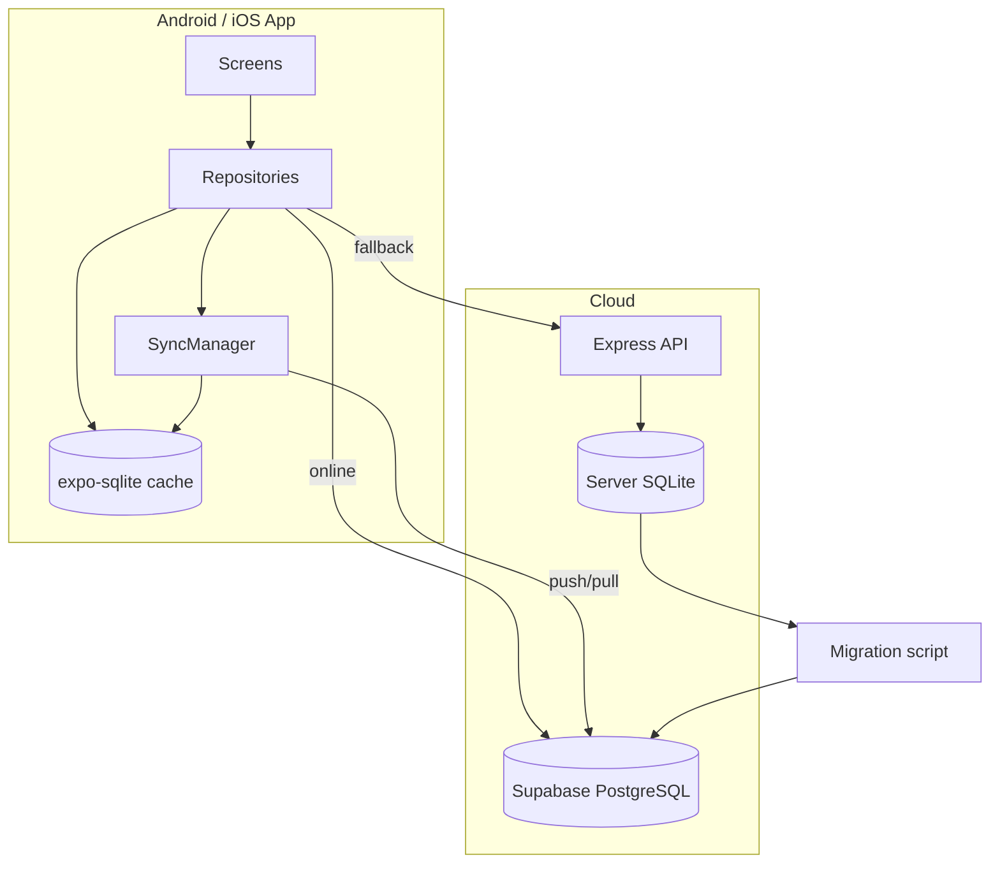

# Kilimo Bridge — SQLite to Supabase migration

Full offline-first architecture: **Supabase = cloud source of truth**, **SQLite on device = offline cache**, **Express backend** migrates server DB and can keep running during transition.

## Architecture



### Sync flow

1. **Online:** Read Supabase → cache in local SQLite. Writes go to Supabase + local cache.
2. **Offline:** Read/write local SQLite; queue changes in `sync_queue`.
3. **Reconnect:** `SyncManager` uploads queue, pulls remote changes, **last-write-wins** on `updated_at`.

### Web (Netlify)

Web builds use API/Supabase directly — no `expo-sqlite` (not available on web). Set `EXPO_PUBLIC_SYNC_MODE=api` for browser-only.

---

## Setup

### 1. Supabase project

1. Create project at [supabase.com](https://supabase.com)
2. SQL Editor → run in order:
   - `supabase/migrations/20250728000000_mirror_schema.sql`
   - `supabase/migrations/20250729000000_offline_first_schema.sql`
3. **Settings → API → JWT Settings** → set JWT secret to match Render `JWT_SECRET`
4. Copy URL, anon key, service role key

### 2. Migrate server SQLite → Supabase

```bash
cd backend
cp .env.example .env   # add SUPABASE_URL + SUPABASE_SERVICE_ROLE_KEY
npm run export:schema   # optional: data/schema-export.json
npm run migrate:supabase
```

Report: `backend/data/migration-report.json`

**Rollback:** Keep `kilimo.db.pre-migration` backup; truncate Supabase tables or re-run after fix.

### 3. Mobile env

```bash
EXPO_PUBLIC_API_URL=https://your-api.onrender.com/api
EXPO_PUBLIC_SUPABASE_URL=https://xxx.supabase.co
EXPO_PUBLIC_SUPABASE_ANON_KEY=eyJ...
EXPO_PUBLIC_SYNC_MODE=hybrid   # or api for web-only
```

### 4. Android / iOS builds

```bash
cd mobile
npx expo install expo-sqlite @react-native-community/netinfo
npx eas build:configure
eas build --platform android
eas build --platform ios
```

Update `app.json` with `bundleIdentifier` / `package` before store submit.

---

## Repositories (mobile)

| Module | Path | Purpose |
|--------|------|---------|
| `FarmerRepository` | `mobile/src/repositories/FarmerRepository.ts` | List/upsert farmers |
| `TaskRepository` | `mobile/src/repositories/TaskRepository.ts` | Farmer tasks |
| `SyncManager` | `mobile/src/sync/SyncManager.ts` | Online/offline sync |
| `syncLogic` | `mobile/src/sync/syncLogic.ts` | Conflict resolution (tested) |

Example:

```typescript
import { farmerRepository } from '../repositories/FarmerRepository';

const { farmers, total, source } = await farmerRepository.list(50, 0, token);
// source: 'supabase' | 'api' | 'local' | 'none'
```

---

## API endpoints (backend)

| Endpoint | Purpose |
|----------|---------|
| `POST /api/admin/sync/supabase/sync` | Push server SQLite → Supabase |
| `GET /api/admin/sync/supabase/status` | Sync metadata |

---

## Testing

```bash
cd mobile && npx tsx src/sync/__tests__/syncLogic.test.ts
```

### Manual QA checklist

See brief Task 7 — test offline mode (disable Wi‑Fi), edit data, reconnect, verify sync banner shows status.

---

## Troubleshooting

| Issue | Fix |
|-------|-----|
| RLS blocks reads | Match Supabase JWT secret to `JWT_SECRET`; log out and log in again |
| Migration row mismatch | Check `migration-report.json` errors; fix FK order |
| Sync stuck | Tap sync banner or call `syncManager.runSync('manual')` |
| Web errors on sqlite | Expected — use `EXPO_PUBLIC_SYNC_MODE=api` on Netlify |

---

## Security

- Service role key: **backend only**
- Anon key: mobile (RLS + Kilimo JWT)
- JWT claims: `userId`, `role`, `farmerId`, `phoneNumber`, `district`

See also: `docs/MIGRATION_CLARIFICATIONS.md`, `docs/SUPABASE_HYBRID.md`
